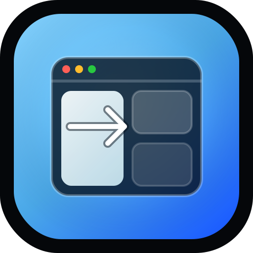

<p align="center">
  
</p>

<h1 align="center">Snapper</h1>

<p align="center">
  Native macOS window snapping with custom zones, global shortcuts, and a quiet menu bar presence.
</p>

<p align="center">
  
  
  
</p>

<p align="center">
  <a href="#quick-start">Quick start</a> ·
  <a href="#build-the-dmg">Build DMG</a> ·
  <a href="#uninstall">Uninstall</a> ·
  <a href="DEV.md">Developer notes</a> ·
  <a href="https://gustavocaiano.github.io/snapper/">Landing page</a>
</p>

---

## What is Snapper?

Snapper is a lightweight SwiftUI menu bar app for putting focused windows exactly where you want them. Define custom snap zones, trigger them with global shortcuts, or use the on-screen editor to shape layouts directly over your real displays.

It is designed for people who want Mac-native window control without a heavy workspace manager.

## Features

| Feature | What it gives you |
| --- | --- |
| **Custom zones** | Draw and save screen regions that match your workflow. |
| **Global shortcuts** | Move the focused window quickly with Carbon hotkeys. |
| **On-screen editor** | Create and adjust zones directly on top of your displays. |
| **Menu bar utility** | Runs as an `LSUIElement` app with no Dock noise. |
| **Local config** | Stores JSON config in `~/Library/Application Support/Snapper/config.json`. |
| **Launch at Login** | Uses `SMAppService` for native login item support. |
| **Free DMG packaging** | Builds a shareable DMG without paid Apple credentials. Release assets are versioned, e.g. `Snapper_v0_1_0.dmg`. |
| **No Screen Recording requirement** | Screen previews use the desktop wallpaper fallback instead of capturing the display. |

## Requirements

- macOS 13 Ventura or newer
- Xcode 15+ or Command Line Tools
- Accessibility permission for Snapper

## Quick Start

Build and launch a local app bundle:

```bash
./scripts/build_app.sh --run
```

Output:

```text
.build/Snapper.app
```

Restart without rebuilding:

```bash
./scripts/start_snapper.sh
```

Reset Accessibility trust if macOS gets confused after local rebuilds:

```bash
./scripts/fix_accessibility.sh
```

## Build the DMG

Create a Finder-friendly disk image with `Snapper.app`, an Applications shortcut, and install guidance:

```bash
./scripts/package_dmg.sh
```

Outputs:

```text
dist/Snapper.app
dist/Snapper.dmg
```

For the full development and release flow, see [`DEV.md`](DEV.md).

To publish a GitHub Release, run:

```bash
./scripts/release.sh
```

The release script asks only for the version, then builds the DMG, creates the tag, pushes it, and uploads a versioned asset such as `Snapper_v0_1_0.dmg` to GitHub Releases.

## Install from the DMG

1. Open the downloaded `Snapper_vx_x_x.dmg`.
2. Drag `Snapper.app` to the **Applications** shortcut.
3. Eject the disk image.
4. Launch Snapper from `/Applications`.
5. Grant Accessibility permission in **System Settings → Privacy & Security → Accessibility**.

No repository terminal scripts are needed after copying the app to `/Applications`.

## Distribution Status

The current free DMG is ad-hoc signed and not Developer ID notarized. Downloaded copies may trigger macOS Gatekeeper warnings on first launch. Use the normal macOS approval flow, such as right-clicking Snapper and choosing **Open**, or approving it from **System Settings → Privacy & Security**.

Developer ID signing and notarization are the recommended future path for smoother public distribution.

## Uninstall

Preferred path: open Snapper from the menu bar and choose **Uninstall Snapper…**. The app asks for confirmation, removes the running `Snapper.app`, deletes local Snapper configuration, resets Accessibility trust, and quits.

If the menu bar icon is missing or unreachable:

```bash
pkill -x Snapper || true
```

Then remove the installed app:

```bash
rm -rf /Applications/Snapper.app
```

Optional: remove local configuration and reset Accessibility trust:

```bash
rm -rf "$HOME/Library/Application Support/Snapper"
tccutil reset Accessibility com.snapper.app
```

## Generate the Xcode Project

This repository uses XcodeGen:

```bash
xcodegen generate
open Snapper.xcodeproj
```

## Clean Reinstall

```bash
./scripts/reinstall_snapper.sh
```

Optional full reset, including local app config:

```bash
./scripts/reinstall_snapper.sh --wipe-config
```

## Project Structure

```text
Snapper/App        App lifecycle, state, menu bar entry
Snapper/Models     Zones, hotkeys, config models
Snapper/Services   Persistence, hotkeys, AX control, displays, login item
Snapper/Views      Menu popover, onboarding, zone editor, overlays
Snapper/Utilities  Geometry, keycode, and modifier helpers
scripts/           Build, start, reinstall, accessibility, DMG packaging
assets/            README/site logo assets
```

## Logo Prompt

Prompt used as the direction for the current logo:

> Create a premium macOS app icon for “Snapper”, a window snapping utility. Dark midnight rounded-square background, cyan-to-blue luminous gradient, a clean macOS window frame with traffic-light controls, one pane snapping into the left half of a grid, subtle glassmorphism, crisp vector geometry, strong silhouette, minimal but polished, no text, suitable as an app icon and GitHub README logo.
